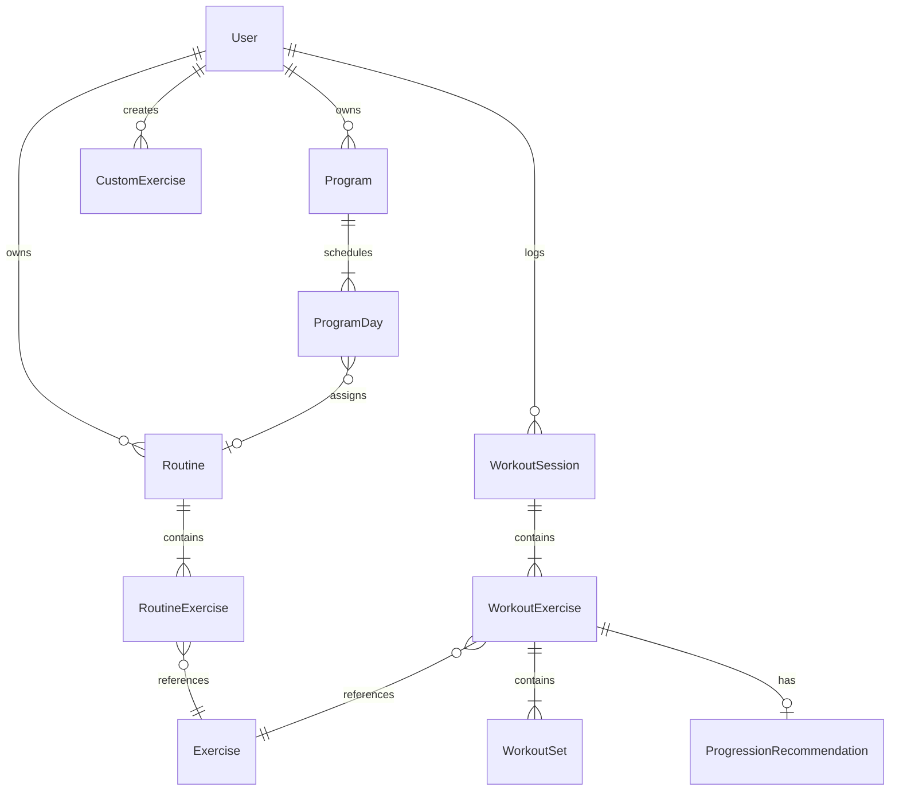

# DailyFitness — Technical Design Document

**Version:** 1.0  
**Last updated:** June 27, 2026  
**Status:** Draft  
**Sources:** [PRD.md](./PRD.md) v0.3 · [USER_STORIES.md](./USER_STORIES.md) v1.0

---

## 1. Overview

### 1.1 Purpose

This document defines the technical architecture, stack decisions, data models, sync strategy, and implementation plan for **DailyFitness** — a native iOS workout tracker with offline-first logging, Lock Screen Live Activities, multi-modal programs, and a strength progression engine.

### 1.2 Goals

| Goal | How we achieve it |
|------|-------------------|
| Sub-3s set logging | Local-first SwiftData, pre-filled values, minimal navigation |
| Offline gym use | All writes local; background sync queue |
| Lock Screen control | ActivityKit Live Activity + App Intents |
| Multi-modal training | Category-aware exercise/set schemas |
| Maintainable v1 | Single iOS target, Supabase BaaS, no custom server |

### 1.3 Non-goals (v1)

- Custom backend services (beyond Supabase)
- Android / Web clients
- Apple Watch target
- AI / ML features
- Real-time multiplayer or social graph

---

## 2. Stack decisions

### 2.1 Summary

| Layer | Choice | Rationale |
|-------|--------|-----------|
| Language | **Swift 6** | Concurrency safety, Apple-first |
| UI | **SwiftUI** | Native haptics, Live Activities, Dynamic Type |
| Min iOS | **iOS 17.0** | ActivityKit interactive buttons, SwiftData maturity |
| Local DB | **SwiftData** | Native persistence, `@Model`, CloudKit-ready if needed later |
| Backend | **Supabase** | Postgres + RLS + Auth + Storage; relational fit for workouts |
| Auth | **Sign in with Apple** via Supabase Auth | App Store expectation; no password management |
| Subscriptions | **StoreKit 2 + RevenueCat** | Receipt validation, trials, cross-platform later |
| Analytics | **TelemetryDeck** | Privacy-friendly, no PII by default |
| CI | **Xcode Cloud** or **GitHub Actions** + `xcodebuild` | TestFlight automation |
| Exercise seed | **ExerciseDB** (open) + manual curation | 2000+ base; JSON import pipeline |

### 2.2 Supabase vs Firebase — decision

**Decision: Supabase**

| Criterion | Supabase | Firebase |
|-----------|----------|----------|
| Data model | Relational (workouts ↔ sets ↔ exercises) | Document nesting gets awkward |
| Queries | SQL — volume by muscle, history ranges | Composite indexes, limited aggregation |
| Row Level Security | Native Postgres RLS per `user_id` | Security rules, harder to audit |
| Swift SDK | Official supabase-swift | Official but Firestore model friction |
| Export / portability | Standard Postgres | Vendor lock-in |
| Cost at scale | Predictable | Reads scale with history queries |

Firebase remains viable for v1, but workout analytics and CSV export are simpler with SQL. **No migration blocker** — repositories abstract the remote layer.

### 2.3 Why not GRDB / Core Data?

**SwiftData** is sufficient for v1 offline-first with `@Query` in SwiftUI. Revisit **GRDB** only if:

- Sync conflict merge exceeds SwiftData comfort zone
- Performance profiling shows write bottlenecks during rapid set logging

---

## 3. Architecture

### 3.1 Layered structure

```
┌─────────────────────────────────────────────────────────┐
│  Presentation                                           │
│  SwiftUI Views · ViewModels (@Observable) · App Intents │
├─────────────────────────────────────────────────────────┤
│  Domain                                                 │
│  Use Cases · ProgressionEngine · PRDetector · Validators│
├─────────────────────────────────────────────────────────┤
│  Data                                                   │
│  Repositories · SwiftData · SyncEngine · SupabaseClient │
└─────────────────────────────────────────────────────────┘
```

### 3.2 Module layout (Xcode targets)

```
DailyFitness/                    # App target
├── App/
│   ├── DailyFitnessApp.swift
│   ├── AppRouter.swift
│   └── DependencyContainer.swift
├── Features/
│   ├── Home/
│   ├── Programs/
│   ├── Workout/                 # Live workout + Live Activity
│   ├── Progress/
│   ├── Profile/
│   └── Onboarding/
├── Domain/
│   ├── Models/                  # Pure Swift structs (DTOs)
│   ├── Progression/
│   └── Services/
├── Data/
│   ├── Persistence/             # SwiftData @Model entities
│   ├── Repositories/
│   ├── Sync/
│   └── Remote/                  # Supabase API
├── DesignSystem/                # Calm Strength tokens, components
└── Resources/
    ├── Exercises/               # seed JSON
    └── Localizable.xcstrings

WorkoutLiveActivity/             # Widget Extension target
├── WorkoutLiveActivity.swift
├── WorkoutLiveActivityBundle.swift
└── Assets.xcassets

DailyFitnessTests/
DailyFitnessUITests/
```

### 3.3 Dependency injection

Use a lightweight **DependencyContainer** (protocol-based, initialized at app launch):

```swift
@MainActor
final class DependencyContainer {
    let exerciseRepository: ExerciseRepository
    let workoutRepository: WorkoutRepository
    let syncEngine: SyncEngine
    let progressionEngine: ProgressionEngine
    let subscriptionService: SubscriptionService
    // ...
}
```

ViewModels receive protocols in `init` for testability. No third-party DI framework in v1.

### 3.4 Concurrency model

| Context | Usage |
|---------|--------|
| `@MainActor` | ViewModels, UI state, Live Activity updates |
| `actor SyncEngine` | Serialize sync queue operations |
| `actor ProgressionEngine` | Pure computation off main thread |
| Background `URLSession` | Supabase uploads via sync engine |

SwiftData reads on main actor; bulk exercise import runs on background with `ModelContext` on background actor pattern.

---

## 4. Data model

### 4.1 Entity relationship diagram



### 4.2 SwiftData entities (local)

All user-owned entities include:

- `id: UUID` (client-generated, stable for sync)
- `userId: UUID`
- `createdAt`, `updatedAt: Date`
- `syncStatus: SyncStatus` (`.pending` | `.synced` | `.conflict`)
- `deletedAt: Date?` (soft delete for sync)

#### Exercise (seed + custom)

```swift
@Model
final class ExerciseEntity {
    @Attribute(.unique) var id: UUID
    var name: String
    var category: ExerciseCategory  // strength | mobility | flexibility | yoga | cardio
    var primaryMuscles: [String]
    var equipment: [String]
    var imageURL: String?
    var isCustom: Bool
    var userId: UUID?               // nil for seeded
    var loggingFields: LoggingFieldMask  // weightReps | duration | hold | side
}
```

#### Routine

```swift
@Model
final class RoutineEntity {
    @Attribute(.unique) var id: UUID
    var name: String
    var exercises: [RoutineExerciseEntity]  // ordered, cascade delete
}

@Model
final class RoutineExerciseEntity {
    var sortOrder: Int
    var exerciseId: UUID
    var targetSets: Int
    var targetRepsMin: Int?
    var targetRepsMax: Int?
    var targetDurationSeconds: Int?
    var restSeconds: Int
    var supersetGroupId: UUID?
    var progressionEnabled: Bool
    var note: String?
}
```

#### Program

```swift
@Model
final class ProgramEntity {
    @Attribute(.unique) var id: UUID
    var name: String
    var category: ProgramCategory
    var isSuggested: Bool             // catalog template vs user-owned
    var sourceTemplateId: UUID?       // if duplicated from suggested
    var weeks: Int?
    var days: [ProgramDayEntity]
    var isActive: Bool
}

@Model
final class ProgramDayEntity {
    var weekIndex: Int
    var dayOfWeek: Int                // 1...7
    var routineId: UUID?
    var sortOrder: Int
}
```

#### Workout session (logged)

```swift
@Model
final class WorkoutSessionEntity {
    @Attribute(.unique) var id: UUID
    var name: String
    var startedAt: Date
    var endedAt: Date?
    var routineId: UUID?
    var programDayId: UUID?
    var note: String?
    var exercises: [WorkoutExerciseEntity]
}

@Model
final class WorkoutExerciseEntity {
    var exerciseId: UUID
    var sortOrder: Int
    var supersetGroupId: UUID?
    var sets: [WorkoutSetEntity]
    var note: String?
}

@Model
final class WorkoutSetEntity {
    var setNumber: Int
    var setType: SetType              // normal | warmup | failure | dropSet
    var weightKg: Double?             // stored canonical; display converts
    var reps: Int?
    var durationSeconds: Int?
    var holdSeconds: Int?
    var side: BodySide?               // left | right | both
    var rir: Int?                     // 0...5, only if user enabled
    var completedAt: Date?
    var isCompleted: Bool
}
```

#### Progression recommendation (computed + cached)

```swift
@Model
final class ProgressionRecommendationEntity {
    @Attribute(.unique) var id: UUID
    var exerciseId: UUID
    var routineExerciseId: UUID?
    var targetWeightKg: Double?
    var targetRepsMin: Int?
    var targetRepsMax: Int?
    var targetRir: Int?
    var reason: String
    var computedAt: Date
}
```

### 4.3 Postgres schema (Supabase)

Mirror local entities with `user_id uuid references auth.users`. Key tables:

```sql
-- RLS policy pattern on all user tables:
-- auth.uid() = user_id

create table exercises (
  id uuid primary key,
  user_id uuid references auth.users,
  name text not null,
  category text not null,
  primary_muscles text[] not null default '{}',
  equipment text[] not null default '{}',
  image_url text,
  is_custom boolean not null default false,
  logging_fields jsonb not null,
  created_at timestamptz not null default now(),
  updated_at timestamptz not null default now(),
  deleted_at timestamptz
);

create table workout_sessions (
  id uuid primary key,
  user_id uuid not null references auth.users,
  name text not null,
  started_at timestamptz not null,
  ended_at timestamptz,
  routine_id uuid,
  program_day_id uuid,
  note text,
  created_at timestamptz not null default now(),
  updated_at timestamptz not null default now(),
  deleted_at timestamptz
);

create table workout_sets (
  id uuid primary key,
  user_id uuid not null references auth.users,
  session_id uuid not null references workout_sessions(id) on delete cascade,
  exercise_id uuid not null,
  set_number int not null,
  set_type text not null default 'normal',
  weight_kg double precision,
  reps int,
  duration_seconds int,
  hold_seconds int,
  side text,
  rir int,
  completed_at timestamptz,
  is_completed boolean not null default false,
  created_at timestamptz not null default now(),
  updated_at timestamptz not null default now()
);

-- Indexes for common queries
create index idx_workout_sessions_user_started
  on workout_sessions (user_id, started_at desc);
create index idx_workout_sets_session
  on workout_sets (session_id);
create index idx_workout_sets_exercise
  on workout_sets (user_id, exercise_id, completed_at desc);
```

Suggested programs ship as **read-only seed rows** with `user_id is null` and `is_suggested = true`, copied to user scope on "Start program".

### 4.4 Weight storage

- **Canonical storage:** kilograms (`Double`) in DB and SwiftData  
- **Display layer:** `WeightFormatter` converts kg ↔ lb based on user preference  
- Avoids floating-point drift on sync

---

## 5. Sync strategy

### 5.1 Offline-first flow

```
User action → Write SwiftData (syncStatus: .pending)
            → Enqueue SyncOperation
            → SyncEngine (when online) → Supabase upsert
            → On success: syncStatus = .synced
            → On failure: retry with exponential backoff
```

### 5.2 SyncEngine

```swift
actor SyncEngine {
    func enqueue(_ op: SyncOperation)
    func flush() async throws
    func pullRemoteChanges(since: Date?) async throws
}
```

**SyncOperation types:** upsertSession, upsertRoutine, upsertProgram, deleteEntity

**Triggers:**

- App foreground
- Network path satisfied (`NWPathMonitor`)
- Workout session saved
- Manual "Sync now" in Profile

### 5.3 Conflict resolution

| Entity | Strategy |
|--------|----------|
| WorkoutSession | **Last-write-wins** on `updated_at` |
| WorkoutSet | Merge by set `id`; client UUID is source of truth |
| Routine / Program | Last-write-wins; warn if conflict on active workout |
| Exercise (custom) | Last-write-wins |

Conflicts are rare (single-user, single-device primary). If `syncStatus == .conflict`, show non-blocking banner in Profile with "Keep local" / "Use cloud" for v1.

### 5.4 Initial restore

On first sign-in on new device:

1. `pullRemoteChanges(since: nil)` paginated (100 sessions per page)
2. Insert into SwiftData if `id` not present
3. Run progression recompute for active routines

---

## 6. Authentication

### 6.1 Sign in with Apple flow

```
ASAuthorizationController
  → identity token
  → supabase.auth.signInWithIdToken(provider: .apple, idToken:)
  → session stored in Keychain via supabase-swift
  → SyncEngine.pullRemoteChanges()
```

### 6.2 Local-only mode

- Users can log workouts without account until first sync prompt or Profile tap
- `userId` = local anonymous UUID until linked; on sign-in, **merge** local data to authenticated `user_id` via upsert with same client UUIDs

### 6.3 Secrets

| Secret | Storage |
|--------|---------|
| Supabase anon key | Xcode build config / xcconfig (not committed) |
| RevenueCat API key | xcconfig |
| Apple Sign In | Entitlements + Supabase Apple provider config |

Use `.xcconfig` + `Secrets.example.xcconfig` in repo; real values in local untracked file.

---

## 7. Live workout & ActivityKit

### 7.1 Architecture

```
WorkoutViewModel (MainActor)
  ↔ WorkoutSessionState (in-memory + SwiftData)
  ↔ LiveActivityManager
       → Activity<WorkoutAttributes>
       → Widget Extension renders Lock Screen / Dynamic Island
  ↔ AppIntent: CompleteSetIntent, EndWorkoutIntent
```

### 7.2 Activity attributes

```swift
struct WorkoutAttributes: ActivityAttributes {
    struct ContentState: Codable, Hashable {
        var exerciseName: String
        var setCurrent: Int
        var setTotal: Int
        var phase: WorkoutPhase  // active | resting
        var restEndsAt: Date?
        var sessionId: UUID
    }
    var workoutName: String
}
```

### 7.3 Interactive actions (iOS 17+)

| Action | App Intent | Behavior |
|--------|------------|----------|
| Complete set | `CompleteSetIntent` | Mark set done, start rest, update Activity |
| +30s rest | `ExtendRestIntent` | Push `restEndsAt` |
| End workout | `EndWorkoutIntent` | Confirm → save session, end Activity |

App Intents call into shared **WorkoutSessionController** (singleton or injected via App Group if needed).

### 7.4 App Group

**App Group:** `group.app.dailybase.dailyfitness`

Share minimal state between app and widget extension:

- Current `sessionId`
- Serialized `ContentState` for intent handlers

### 7.5 Fallback path

If Live Activities unavailable or denied:

- In-app `RestTimerView` with `TimelineView`
- Optional `UNUserNotificationCenter` local notification at rest end (user toggle)

---

## 8. Progression engine

### 8.1 Scope

- **Strength exercises only** (`ExerciseCategory.strength`)
- **Per-exercise opt-out** via `RoutineExerciseEntity.progressionEnabled`
- **Premium gate:** free users get recommendations for first 2 strength exercises per session (by sort order)

### 8.2 Interface

```swift
struct ProgressionInput {
    let exerciseId: UUID
    let history: [CompletedWorkingSet]  // last 1–3 sessions
    let targets: RepRange
    let rirEnabled: Bool
    let incrementKg: Double
}

struct ProgressionOutput {
    let targetWeightKg: Double?
    let targetRepsMin: Int
    let targetRepsMax: Int
    let targetRir: Int?
    let action: ProgressionAction  // increase | hold | decrease
    let reason: String
}

protocol ProgressionEngineProtocol {
    func recommend(input: ProgressionInput) -> ProgressionOutput
}
```

### 8.3 Algorithm (v1)

Pure function, unit-tested — implements PRD §12:

1. Filter warmup sets from history  
2. If `rirEnabled` && RIR logged → compare performance to predicted max at target RIR  
3. Else → if all working sets hit `targetRepsMax` → increase weight by `incrementKg`  
4. If below `targetRepsMin` for 2 consecutive sessions → decrease 5–10%  
5. Else → hold  

**Deload flag:** after 3 consecutive `hold` with missed bottom range → surface `DeloadSuggestion` (non-blocking).

### 8.4 When it runs

- After workout session saved (background)
- Before live workout starts (pre-fill targets on exercise cards)
- Not during set logging (no blocking)

---

## 9. PR detection & analytics

### 9.1 PRDetector

On set complete (strength only):

```swift
enum PRType { case weight, reps, estimated1RM, sessionVolume }

func detectPRs(set: WorkoutSet, history: ExerciseHistory) -> [PersonalRecord]
```

Compare against stored PR table (`PersonalRecordEntity`) — update if exceeded.

### 9.2 e1RM formula

**Epley:** `weight × (1 + reps / 30)` — standard, easy to explain in UI.

### 9.3 Aggregations (local)

| Query | Implementation |
|-------|----------------|
| Volume by muscle | Join sets → exercises → `primaryMuscles`, sum `weight × reps` |
| 90-day chart window | Free tier filter on `completedAt` |
| Mobility/yoga time | Sum `durationSeconds` where category != strength |

Heavy aggregates run in background; cache daily summaries in `DailySummaryEntity` to keep Progress tab snappy.

---

## 10. Exercise library pipeline

### 10.1 Seed data

```
Resources/Exercises/
├── exercises.json          # 2000+ records
├── muscles.json            # taxonomy
└── equipment.json
```

**Import script** (Python in `scripts/import-exercises.py`):

1. Validate schema (name, category, muscles non-empty)
2. Dedupe by normalized name
3. Output SQL migration + bundled JSON for app first launch

### 10.2 First launch

```swift
func seedExercisesIfNeeded(context: ModelContext) async {
    guard !UserDefaults.standard.bool(forKey: "exercisesSeeded") else { return }
    // Batch insert 500 rows at a time
    UserDefaults.standard.set(true, forKey: "exercisesSeeded")
}
```

### 10.3 Images

- v1: bundled assets for top 500; remote URL (Supabase Storage) for remainder  
- CDN path: `exercises/{id}.webp`  
- Placeholder illustration for missing media

### 10.4 Yoga / mobility gap fill

ExerciseDB skews strength — manual curation CSV (~200 rows) merged in import pipeline for yoga flows and mobility holds.

---

## 11. Programs system

### 11.1 Suggested program catalog

- Stored as `ProgramEntity` with `isSuggested = true`, `userId = nil` in bundle JSON  
- On **Start program:** shallow copy to user scope with new UUIDs, `sourceTemplateId` preserved, `isActive = true`  
- Only one active program at a time in v1 (deactivate previous on start)

### 11.2 Schedule resolution

```swift
func todaysWorkout(program: Program, date: Date) -> Routine? {
    // Map calendar week index + dayOfWeek → ProgramDay → Routine
}
```

Home screen queries active program + today's slot.

---

## 12. Subscriptions (DailyFitness Pro)

### 12.1 Products

| Product ID | Type |
|------------|------|
| `com.dailybase.dailyfitness.pro.monthly` | Auto-renewable |
| `com.dailybase.dailyfitness.pro.yearly` | Auto-renewable |

### 12.2 Entitlement checks

```swift
@Observable
final class SubscriptionService {
    var isPro: Bool { entitlement.active }
    func refresh() async
}
```

RevenueCat `CustomerInfo` cached locally; refresh on app launch and after purchase.

### 12.3 Feature gates

| Feature | Gate |
|---------|------|
| 6th routine/program | `isPro` |
| Progression exercise 3+ per workout | `isPro` |
| History > 90 days | `isPro` |
| CSV export | `isPro` |
| Muscle volume all-time | `isPro` |

Gate in **domain layer** (use case), not just UI — prevents bypass.

---

## 13. Design system implementation

### 13.1 Token file

```swift
enum CalmStrength {
    enum Color {
        static let background = Color("Background")      // #F5F2ED light
        static let primary = Color("Primary")          // #2D4A3E
        static let accent = Color("Accent")            // #7A9E8E sage
    }
    enum Spacing { static let md: CGFloat = 16 /* ... */ }
    enum Radius { static let card: CGFloat = 12 }
}
```

Asset catalog with light/dark variants. No hardcoded hex in views.

### 13.2 Components

Reusable: `DFButton`, `DFCard`, `SetRow`, `RestTimerRing`, `ExercisePicker`, `ProgramCard`

Live workout uses **large touch targets** (min 44pt) and high-contrast complete button.

---

## 14. Navigation & state

### 14.1 AppRouter

```swift
@Observable
final class AppRouter {
    var selectedTab: Tab = .home
    var activeWorkoutSessionId: UUID?
    var presentedSheet: Sheet?
}
```

Live workout presented as `fullScreenCover` when `activeWorkoutSessionId != nil`.

### 14.2 Workout resume

- Incomplete session (`endedAt == nil`) detected on launch  
- Prompt: Resume / Discard  
- `sessionId` in App Group for Live Activity continuity

---

## 15. Security & privacy

| Topic | Approach |
|-------|----------|
| Auth tokens | Keychain via supabase-swift |
| RLS | All Supabase tables; users only see own rows |
| Analytics | No email, no workout content in events; aggregate only |
| Export | User-initiated CSV; share sheet |
| Account delete | Soft-delete remote + wipe local SwiftData |
| ATT | Not required v1 (no cross-app tracking) |

---

## 16. Testing strategy

### 16.1 Unit tests (DailyFitnessTests)

| Area | Priority |
|------|----------|
| ProgressionEngine | P0 — table-driven tests for all rules |
| PRDetector | P0 |
| WeightFormatter | P0 |
| ProgramScheduleResolver | P1 |
| SyncOperation merge | P1 |

### 16.2 Integration tests

- SwiftData in-memory container: log workout → verify PR + progression  
- Mock Supabase client: sync upsert payload shape

### 16.3 UI tests (DailyFitnessUITests)

- Start routine → complete 2 sets → end workout  
- Onboarding skip path → Home  
- Premium paywall at routine limit (mock `isPro = false`)

### 16.4 Manual QA checklist

- [ ] Live Activity on physical device (simulator limited)  
- [ ] Airplane mode full workout → sync on reconnect  
- [ ] Sign in with Apple on second device → history restore  
- [ ] Dynamic Type XXL on live workout screen  
- [ ] VoiceOver complete-set flow  

---

## 17. Performance targets

| Metric | Target |
|--------|--------|
| Cold launch to Home | < 1.5s |
| Exercise search (2000+) | < 300ms |
| Set complete → UI update | < 100ms |
| SwiftData save per set | Async, non-blocking UI |
| Live Activity update | < 200ms after set complete |
| Initial exercise seed | Background; splash only first install |

---

## 18. Infrastructure & environments

### 18.1 Supabase projects

| Env | Purpose |
|-----|---------|
| `dailyfitness-dev` | Development + TestFlight internal |
| `dailyfitness-prod` | App Store |

### 18.2 Migrations

SQL migrations in `supabase/migrations/` managed via Supabase CLI:

```bash
supabase db push
supabase gen types typescript --local  # optional; Swift types manual
```

### 18.3 Bundle IDs

| Target | Bundle ID |
|--------|-----------|
| App | `app.dailybase.dailyfitness` |
| Live Activity | `app.dailybase.dailyfitness.liveactivity` |

### 18.4 CI pipeline

1. `swiftlint` (optional v1)  
2. `xcodebuild test -scheme DailyFitness -destination 'platform=iOS Simulator,name=iPhone 16'`  
3. Archive + TestFlight on `main` tag  

---

## 19. Implementation phases (mapped to PRD)

| Phase | Weeks | Deliverables |
|-------|-------|--------------|
| **0** | 1–2 | Xcode project, SwiftData models, Calm Strength tokens, exercise seed, Supabase schema, Sign in with Apple |
| **1** | 3–6 | Routine CRUD, live workout VM, rest timer, SyncEngine, Live Activity extension |
| **2** | 7–9 | Programs catalog, progression engine, PR/history, onboarding, TestFlight |
| **3** | 10–12 | RevenueCat, paywalls, CSV export, App Store submit |

---

## 20. Open technical questions

| # | Question | Recommendation | Decide by |
|---|----------|----------------|-----------|
| 1 | Supabase vs Firebase | **Supabase** | Phase 0 ✓ |
| 2 | Min iOS version | **17.0** | Phase 0 |
| 3 | Anonymous local → Apple ID merge | Upsert by client UUID | Phase 0 spike |
| 4 | Exercise images: bundle vs CDN | Hybrid (top 500 bundled) | Phase 1 |
| 5 | Suggested programs in bundle vs remote | Bundle JSON v1; remote updatable v1.1 | Phase 2 |
| 6 | Trademark / bundle ID final | Legal check on `dailyfitness` | Before TestFlight |

---

## 21. Appendix

### A. Key third-party packages

| Package | Version pin | Purpose |
|---------|-------------|---------|
| [supabase-swift](https://github.com/supabase/supabase-swift) | 2.x | Auth, database, storage |
| [RevenueCat/purchases-ios](https://github.com/RevenueCat/purchases-ios) | 5.x | Subscriptions |
| [TelemetryDeck/SwiftSDK](https://github.com/TelemetryDeck/SwiftSDK) | 2.x | Analytics |

No Lottie, no heavy networking libs — URLSession + supabase-swift sufficient.

### B. Supabase RLS example

```sql
alter table workout_sessions enable row level security;

create policy "Users manage own sessions"
  on workout_sessions for all
  using (auth.uid() = user_id)
  with check (auth.uid() = user_id);
```

### C. Live Activity permission copy

> Show your current exercise and rest timer on the Lock Screen — complete sets without unlocking your phone.

### D. Document history

| Version | Date | Changes |
|---------|------|---------|
| 1.0 | 2026-06-27 | Initial TDD from PRD v0.3 |

### E. Related docs

- [PRD.md](./PRD.md)  
- [USER_STORIES.md](./USER_STORIES.md)

---

*Next step: Phase 0 — scaffold Xcode project, Supabase project, and SwiftData models.*
